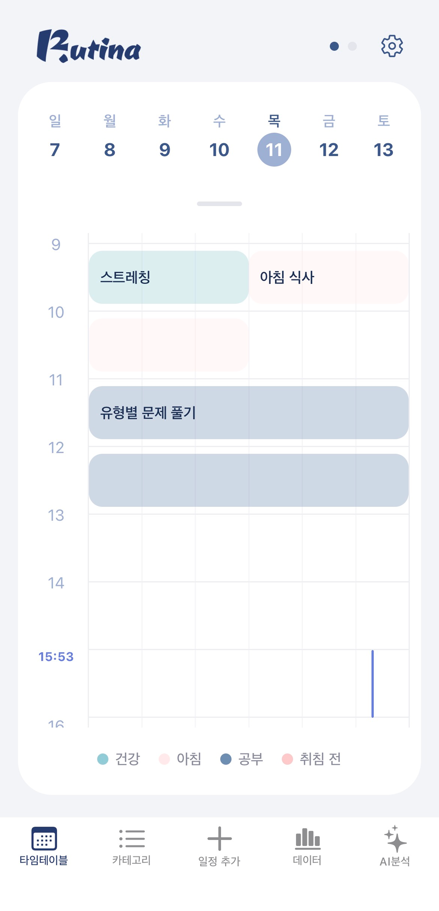
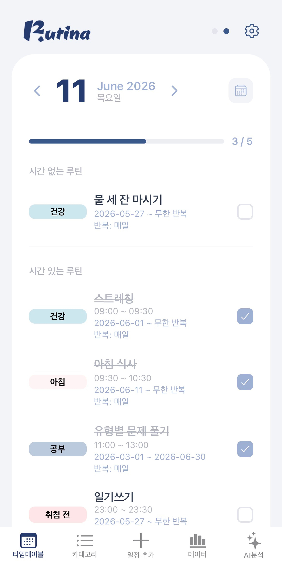
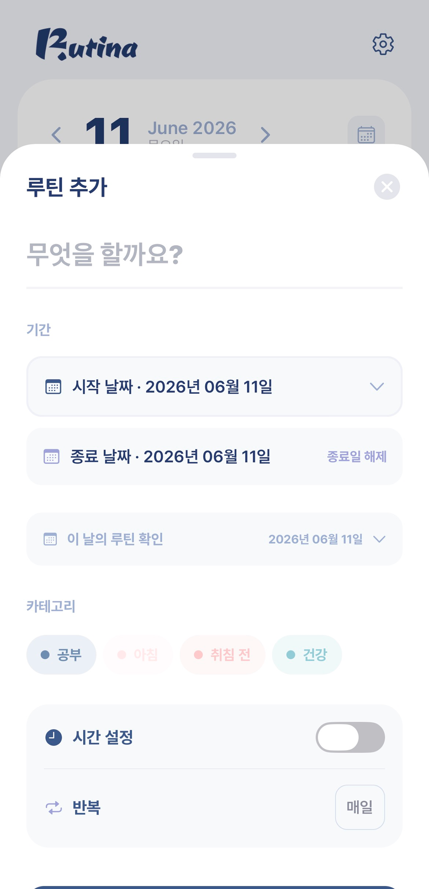
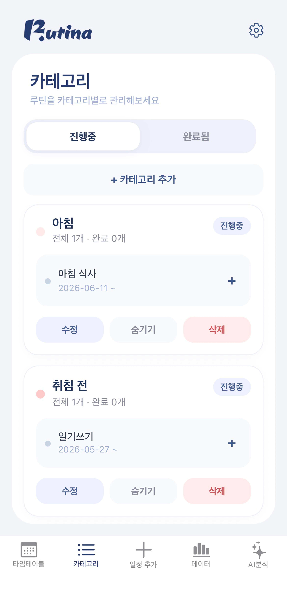
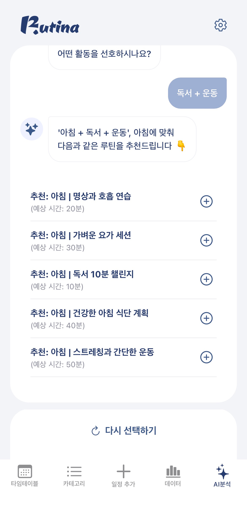
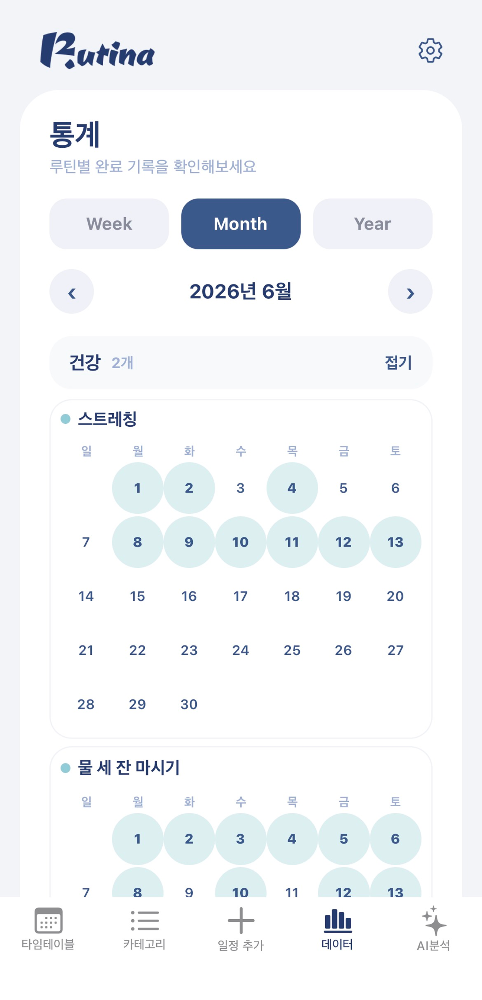

<div align="center">


**루티나(Rutina)** — 하루의 흐름을 타임테이블로 설계하고, AI가 루틴을 추천해주는 루틴 관리 앱

스페인어 *rutina*(루틴)에서 이름을 따온 프로젝트입니다.

<a href="https://apps.apple.com/app/rutina/id6769327521">
  
</a>
&nbsp;
<a href="https://rutina.co.kr/">
  
</a>  

> Android 버전은 현재 출시 준비 중입니다.

</div>

---

## 목차

- [소개](#소개)
- [화면](#화면)
- [핵심 기능](#핵심-기능)
- [기술 스택](#기술-스택)
- [시스템 아키텍처](#시스템-아키텍처)
- [API 개요](#api-개요)
- [로컬 실행](#로컬-실행)
- [배포](#배포)
- [팀 소개](#팀-소개)

---

## 소개

Rutina는 사용자가 하루 루틴을 **시간대 기반 타임테이블**로 관리하고, 누적된 실천 기록을 **히트맵**으로 돌아보며, **AI 추천**으로 새로운 루틴을 발견할 수 있도록 돕는 모바일 앱입니다.

이 저장소는 Rutina의 **백엔드 서버**입니다. Spring Boot 기반 REST API와 OAuth2 소셜 로그인, AI 추천, 공식 소개 페이지 정적 서빙을 담당합니다.

- **공식 사이트**: https://rutina.co.kr/
- **앱 도메인 / 발신 메일**: `rutina.co.kr` · `official@rutina.co.kr`

---

## 화면

| 메인 타임테이블 |                                         루틴 목록                                         |                                        루틴 추가                                         |
|:---:|:-------------------------------------------------------------------------------------:|:------------------------------------------------------------------------------------:|
|  |  |  |

|                                    카테고리                                     |                                    AI 추천                                    | 히트맵 |
|:---------------------------------------------------------------------------:|:---------------------------------------------------------------------------:|:---:|
|  |  |  |

---

## 핵심 기능

- **타임테이블 뷰** — 하루를 시간대로 나누어 루틴을 배치. `04:00`을 하루 경계로 처리해 새벽 루틴까지 자연스럽게 표현합니다.
- **AI 루틴 추천** — Spring AI + OpenAI GPT-4o-mini 기반으로 사용자 맥락에 맞는 루틴을 추천하고, 추천 결과를 바로 내 루틴에 추가할 수 있습니다.
- **히트맵 시각화** — 주/월/년 단위로 루틴 실천 기록을 시각화합니다.
- **소셜 로그인** — Kakao · Naver · Google · Apple OAuth2 로그인 + JWT 인증.
- **이메일 인증 / 비밀번호 재설정** — 인증 코드 발송 및 검증 흐름.
- **회원 탈퇴** — AI 로그 익명화 → soft delete → 스케줄러 정리로 이어지는 안전한 탈퇴 처리.

---

## 기술 스택

| 구분 | 기술 |
|---|---|
| Language | Java 21 |
| Framework | Spring Boot 3.5 |
| Architecture | Domain-based 패키지 + Layered Architecture |
| Security | Spring Security, OAuth2 Client (Kakao / Naver / Google / Apple), JWT |
| Persistence | Spring Data JPA, QueryDSL, Flyway |
| Database | PostgreSQL (Supabase) |
| Cache | Redis |
| AI | Spring AI + OpenAI GPT-4o-mini |
| Mail | Spring Mail + Thymeleaf 템플릿 |
| Docs | springdoc-openapi (Swagger UI) |
| Infra | AWS Lightsail, Docker Compose, GitHub Actions, GHCR |

---

## 시스템 아키텍처

```
┌─────────────┐        ┌──────────────────────────────────────┐        ┌──────────────────┐
│   Client    │        │              Server                  │        │ External Services│
│ (Expo RN)   │        │            (Spring Boot)             │        │                  │
│             │        │                                      │        │  Kakao / Naver   │
│     iOS     │ ─────▶ │  Controller → Service → Repository   │ ─────▶ │  Google / Apple  │
│             │  HTTPS │                                      │        │  OAuth2          │
└─────────────┘        │   ┌────────┐   ┌──────┐   ┌──────┐   │        │                  │
                       │   │  JWT   │   │ JPA  │   │Redis │   │        │  OpenAI API      │
                       │   │ Filter │   │      │   │Cache │   │        │  (GPT-4o-mini)   │
                       │   └────────┘   └───┬──┘   └──────┘   │        │                  │
                       └────────────────────┼─────────────────┘        └──────────────────┘
                                            │
                                   ┌────────▼────────┐
                                   │   PostgreSQL    │
                                   │   (Supabase)    │
                                   └─────────────────┘
```

요청은 클라이언트 → JWT 인증 필터 → Controller → Service → Repository 순으로 흐릅니다. 소셜 로그인은 외부 OAuth2 공급자를, AI 추천은 OpenAI API를 호출합니다.

---

## API 개요

Base URL: `https://rutina.co.kr` · Swagger UI: `/swagger-ui.html`

| 그룹 | 엔드포인트 | 설명 |
|---|---|---|
| Auth | `/api/v1/auth` | 로그인, 토큰 재발급, 로그아웃 |
| Auth (Email) | `/api/v1/auth/email` | 회원가입, 이메일 인증, 비밀번호 재설정 |
| User | `/api/v1/users` | 내 정보, 프로필/닉네임 수정, 신규 유저 상태 |
| Routine | `/api/v1/routines` | 루틴 CRUD, 타임테이블, 순서 변경, 일일 목표 토글 |
| Category | `/api/v1/categories` | 카테고리 CRUD, 숨김 처리 |
| AI Routine | `/api/v1/ai-routines` | AI 추천, 오늘의 추천, 추천 루틴 추가 |

---

## 로컬 실행

### 요구 사항

- JDK 21
- PostgreSQL 접속 정보 (Supabase)
- Redis — 로컬 미사용 시 `local` 프로파일의 InMemory 구현으로 대체됩니다.

### 실행

```bash
# 저장소 클론
git clone https://github.com/induk-capstone-team/rutina-backend.git
cd rutina-backend

# local 프로파일로 실행
./gradlew bootRun --args='--spring.profiles.active=local'

# 값 채운 뒤 실행
cp .env.sample .env   
```

> 환경 변수(OAuth2 클라이언트, JWT 시크릿, DB 접속 정보, OpenAI 키 등)는 `application-local.yaml` 또는 환경 변수로 주입합니다.
> Flyway/DDL은 Supabase **Direct Connection(5432)**, 런타임은 **Pooler(6543)** 를 사용합니다.

### 마이그레이션

DB 스키마는 Flyway로 관리합니다. 적용된 마이그레이션 파일은 수정하지 않고 항상 **새 버전 파일**(`V{n}__설명.sql`)로 추가합니다.

---

## 배포

GitHub Actions 기반 CI/CD로 운영됩니다.

```
CI (ci.yml)  →  merge  →  CD (cd.yml)
빌드·검증                  이미지 빌드 → GHCR 푸시 → Lightsail 배포
```

- **Container Registry**: `ghcr.io/induk-capstone-team/rutina-backend`
- **배포 서버**: AWS Lightsail (`/home/ubuntu/rutina/`), Docker Compose
- CI → merge → deploy 흐름을 우회하지 않도록 CD에는 `workflow_dispatch`를 두지 않습니다.

---

## 팀 소개

| 이름  | 역할 | GitHub                                   |
|-----|---|------------------------------------------|
| 송지현 | Backend | [@Jihyeonnn](https://github.com/Jihyeonnn)                 |
| 이성원 | Backend | [@swon0913](https://github.com/swon0913)                 |
| 김도현 | Backend | [@dodo5517](https://github.com/dodo5517) |
| 차부곤 | Frontend | [@Dev-Combu](https://github.com/Dev-Combu)                 |
| 김다현 | Frontend | [@kimmmddh](https://github.com/kimmmddh)                 |


---

<div align="center">

**Rutina** · [rutina.co.kr](https://rutina.co.kr/) · `official@rutina.co.kr`

</div>